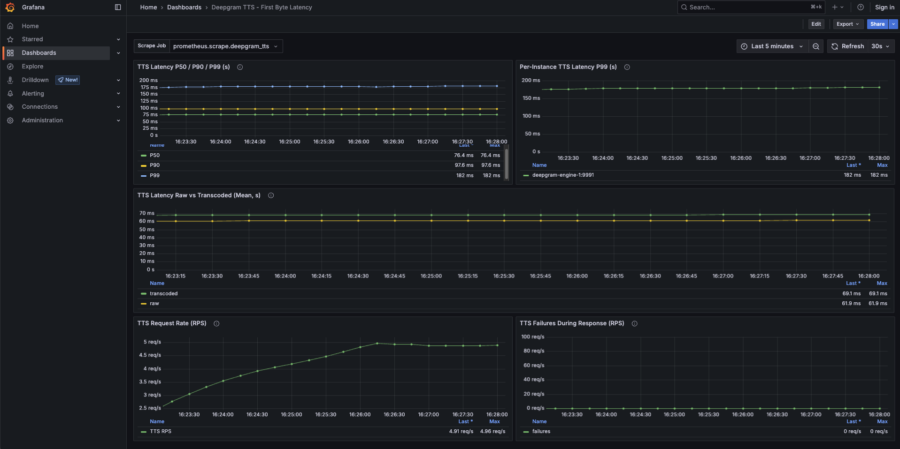

# Deepgram Self-Hosted Monitoring

This directory contains Grafana dashboard templates and Prometheus alert rules for monitoring Deepgram self-hosted deployments:

- `grafana_dashboard_template.json` — general health and performance
- `grafana_tts_dashboard_template.json` — TTS first-byte latency
- `prometheus_tts_alert_rules.yml` — TTS latency alerts, with unit tests

## Overview

The dashboard provides monitoring of health and performance metrics including:

- **Request Metrics**: Active requests, request rates, and status code breakdowns
- **Error Monitoring**: Error rates (4xx/5xx) and per-pod error tracking
- **Latency Metrics**: Batch and streaming latency at P50, P90, and P99 percentiles
- **Capacity Monitoring**: Streaming load, capacity estimation, and saturation levels
- **Per-Pod Metrics**: Individual pod performance and error rates

## Requirements

- Grafana 12.3.0 or higher
- Prometheus datasource configured

## Usage

1. Import the `grafana_dashboard_template.json` file into your Grafana instance
2. Configure the Prometheus datasource (DS_PROMETHEUS) when prompted
3. The dashboard will automatically populate with metrics from your Prometheus instance

## Dashboard Features

The dashboard includes panels for:
- Active requests per pod
- Request rate by kind (RPS)
- Error rate percentages
- Status code breakdown
- Batch and streaming latency percentiles
- Stream capacity and load saturation
- Connection latency
- Per-pod error rates and latency metrics

## TTS First-Byte Latency Dashboard

`grafana_tts_dashboard_template.json` covers text-to-speech first-byte latency, which the general dashboard above does not include. It is built on the two histograms Engine exposes for TTS:

- `engine_tts_first_transcoded_byte_latency` — time to the first byte the caller receives, transcoding included
- `engine_tts_first_raw_byte_latency` — inference only, before transcoding



*Example data for illustration.*

### Model coverage

Deepgram serves TTS through two model generations, on separate endpoints:

| Model family | Endpoint | `tier` label |
|---|---|---|
| Aura / Aura-2 | `/v1/speak` | `aura`, `aura-2` |
| Flux TTS | `/v2/speak` | `flux` |

Flux TTS is streaming-first and requires `release-260812` or later. It also requires a dedicated Engine and cannot share one with Aura models, so each runs as its own scrape target. The panels do not filter on the `tier` label, so they apply to whichever model family the selected Engine serves — choose it with the **Scrape Job** dropdown.

Not to be confused with `engine.flux` in the Helm chart, which configures Flux turn-based streaming *speech-to-text*. Its `engine_flux_*` metrics are unrelated to TTS and are not covered by this dashboard.

### Requirements

- Grafana 12.0.0 or higher
- Prometheus datasource configured
- Engine's metrics endpoint registered as a Prometheus scrape target

### Usage

1. Import the `grafana_tts_dashboard_template.json` file into your Grafana instance
2. Configure the Prometheus datasource (DS_PROMETHEUS) when prompted
3. Select your Engine's scrape job from the **Scrape Job** dropdown

### Panels

- **TTS Latency P50 / P90 / P99** — caller-perceived first-byte latency
- **Per-Instance TTS Latency P99** — isolates a single slow replica
- **TTS Latency Raw vs Transcoded (Mean)** — the gap between the two lines is time spent transcoding, which separates a GPU regression from a transcode regression
- **TTS Request Rate** — the rate the alert rules gate on; read the latency panels against it
- **TTS Failures During Response** — audio generation that broke after the response had already started

### Notes

- Panels filter on the `job` label rather than `namespace`, so this dashboard works for both Docker Compose and Kubernetes deployments. Add a `namespace` filter if you prefer to match the general dashboard above.
- TTS metrics are registered lazily. An Engine that has not yet served a TTS request exposes no `engine_tts_*` series at all, so it will not appear in the **Scrape Job** dropdown until it does — use an `up`-based check to detect a silent Engine.
- Latency values are in seconds, despite these metric names carrying no `_seconds` suffix.
- The first-byte histograms are the whole TTS latency surface for self-hosted builds. Per-pipeline internals (Aura-2 batcher, Flux TTS slot and queue depths) are not exposed, so there is nothing more granular to chart.
- The failures panel queries `engine_tts_failures_during_response_total`. Engine exposes counters in OpenMetrics format with the `_total` suffix; if your build omits it, drop the suffix from that panel's query.

## Recommended Alerts

### Example: Streaming P99 latency alert in Grafana

1. In Grafana, go to **Alerting → Alert rules → New alert rule**.
2. Choose the **Prometheus** data source (same as your dashboard).
3. In the query editor, paste:

   ```
   histogram_quantile(
     0.99,
     sum by (namespace, le) (
       rate(engine_stream_latency_bucket{namespace=~"dg-.*"}[5m])
     )
   )
   ```

4. Click **Run queries** to verify you see values.
5. Under **Conditions**, set something like:
   - WHEN `A` **IS ABOVE** `1.5`
   - FOR `5m`
6. Set:
   - **Rule name**: `DeepgramHighStreamingP99Latency`
   - **Folder**: `Deepgram SLOs`
   - **Evaluation interval**: `30s` or `1m`
7. Attach a **Contact point** (Slack, email, etc.) and a **Notification policy**.

Repeat similar steps for:

### Error rate alert

**Query:**

```
(
  sum by (namespace) (
    rate(engine_requests_total{
      namespace=~"dg-.*",
      response_status=~"5.."
    }[5m])
  )
  /
  sum by (namespace) (
    rate(engine_requests_total{
      namespace=~"dg-.*"
    }[5m])
  )
)
```

**Condition:**
- WHEN `A` **IS ABOVE** `0.05`
- FOR `2m`

### Saturation alert

**Query:**

```
100 *
(
  sum by (namespace) (
    rate(engine_requests_total{
      namespace=~"dg-.*",
      kind="stream"
    }[1m])
  )
  /
  avg by (namespace) (
    engine_estimated_stream_capacity{
      namespace=~"dg-.*"
    }
  )
)
```

**Condition:**
- WHEN `A` **IS ABOVE** `70`
- FOR `10m`

### TTS first-byte latency alerts

`prometheus_tts_alert_rules.yml` contains three recording rules and four alerts, loadable directly by Prometheus:

| Alert | Condition | Severity |
|---|---|---|
| `TTSLatencyHigh` | P90 above 200ms for 5m | warning |
| `TTSLatencyVeryHigh` | P90 above 400ms for 2m | critical |
| `TTSTailLatencyVeryHigh` | P99 above 500ms for 2m | critical |
| `TTSLatencyRegression` | P90 doubled versus an hour earlier, for 15m | warning |

Every threshold sits on an actual histogram bucket boundary (the TTS latency buckets are 0.05, 0.1, 0.2 … 2.0, 2.5, 3.0, 4.0, 5.0, 10.0, 30.0, 60.0), so each condition is exact rather than dependent on interpolation inside a bucket. All four are gated on a minimum request rate, because a quantile computed over a near-empty window just tracks the single slowest request.

Treat the thresholds as a starting point. Baseline against your own hardware under production traffic before committing to them. They were derived from an Aura-2 deployment; Flux TTS is streaming-first and may have a different first-byte profile, so re-baseline before adopting them there.

Unit tests are included:

```
promtool check rules prometheus_tts_alert_rules.yml
promtool test rules prometheus_tts_alert_rules_test.yml
```

To configure the equivalent as a Grafana-managed alert instead, follow the steps in the streaming example above using this query:

```
histogram_quantile(
  0.90,
  sum by (le) (
    rate(engine_tts_first_transcoded_byte_latency_bucket[5m])
  )
)
```

**Condition:**
- WHEN `A` **IS ABOVE** `0.2`
- FOR `5m`
